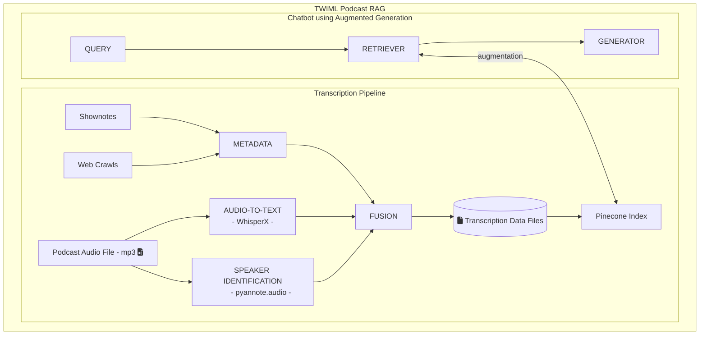

# TWIML-RAG - a TWIML generative_ai community project.

This project aims to create a generative AI dialog application as a learning exercise for our community. The application will consist of a transcription pipeline to transcribe TWIML podcast episodes for human and bot consumption, and the dialog agent/bot itself, which will be available to our community to answer questions about the podcast and its subject area. Both of these aim to offer additional resource for podcast listeners and community members to further their learning and education about ML/AI.

### Transcriber
[proj/transcriber](proj/transcriber)

### Chatbot
[proj/chatbot](proj/chatbot)

