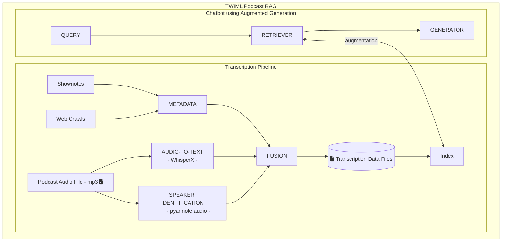

# TWIML-RAG - a TWIML generative_ai community project.

This project aims to create a generative AI dialog application as a learning exercise for our community. The application consists of a transcription pipeline to transcribe TWIML podcast episodes for human and bot consumption, and the dialog agent/bot itself, which will be available to our community to answer questions about the podcast and its subject area. Both of these aim to offer additional resources for podcast listeners and community members to further their learning and education about ML/AI.

## Architecture

## Project/Repo Overview

There are four components to the project/repository. The first is the Speech-to-Text Pipeline (`speech_to_text`) which is used to create the transcripts from the podcasts. Next is the Embeddings Pipeline (`embeddings`) that creates the embeddings from the transcripts. Third is the RAG Backend (`fn_rag`) which runs azure functions locally that serve as end-points for the RAG client. And finally the RAG Frontend (`web_rag`) is the website to run the RAG client which calls the azure end-points.

## Repo Setup Instructions

Please see the individual component README files for setup instructions.

### Speech to Text Pipeline

See [speech_to_text/README.md](proj/speech_to_text/README.md)

### Qdrant Embeddings

See [embeddings/README.md](proj/embeddings/README.md)

### Rag Backend (Azure Functions)

See [fn_rag/README.md](proj/fn_rag/README.md)

### RAG Frontend (Browser)

See [web_rag/README.md](proj/web_rag/README.md)
